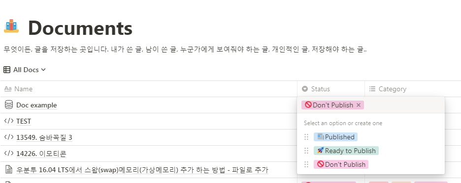

# notion-markdown-updater

automatically parse & upload markdown file from document at notion database by just a click.   
- Used Unofficial Python 3 client for Notion.so API v3, [notion-py](https://github.com/jamalex/notion-py)
- Check if there is any post ready for publish every interval you want, then parse the post into markdown & save it.
- After saving file, you can also automate deploying your blog by `git push` (On Working)

## Prepare
### on notion
add **Select** property to your notion database like example below. *One option* (**🚀Ready to Publish**) will be the trigger to publish and *one option* (**📰Published**) will be the result.   
   
<br/>

### on local
install `notion-py` to your python environment.
```shell
pip install notion
```

## Install & Quick Start
1. On `config.py`, edit the option text to your option that you set on [Prepare](#Prepare). You can use emoji.
```python
# post status str
publish_ready = "Your Option 1"
published = "Your Option 2"
```
2. Clone this repository to your local.   
    ```shell
    $ git clone https://github.com/shinjawkwang/notion-markdown-updater.git`
    ```
3. Install cron if not exist.
    ### Ubuntu
    ```shell
    $ sudo apt-get install -y cron 
    ```
    ### CentOS **(No tested)**
    ```shell
    $ yum -y install cronie
    ```
4. Run `crontab -e` and set environment variable. **The variable name should be accurate!**
    ```shell
    $ crontab -e
    NOTION_TOKEN=<YOUR_NOTION_TOKEN>
    DOCUMENTS_URL=<URL_OF_THE_PLACE_WHERE_YOUR_DATABASE_IS>
    ```
    `DOCUMENTS_URL` is just link of the page you want to register; it should be kind of database.
5. Before saving, register cron job.
    ```shell
    # Without log output
    * * * * * python3 /absolute/path/of/repo/notion-markdown-updater/notion_updater.py
    # With log of output or error (Recommend)
    * * * * * python3 /absolute/path/of/repo/notion-markdown-updater/notion_updater.py >> ~/.log/log_`date +\%Y-\%m-\%d`.log 2>&1
    ```
6. Restart cron service.
    ### Ubuntu
    ```shell
    sudo service cron restart
    ```
    ### CentOS **(No tested)**
    ```shell
    sudo service crond restart
    ```
7. Done!